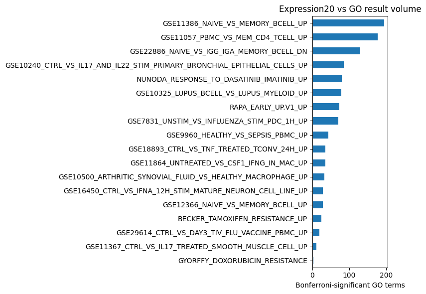

<!-- Generated by scripts/render_notebooks_for_mdbook.py; edit the notebook source instead. -->

# Expression20 vs GO

Source notebook: [`../../notebooks/02_expression20_eval.ipynb`](../../notebooks/02_expression20_eval.ipynb)

This notebook runs 20 expression-derived MyGeneset/MSigDB signatures against an official GOA human/GO snapshot. The CLI does the enrichment; Python only summarizes the Parquet results.

```bash
python3 scripts/fetch_mygeneset_eval.py \
  --manifest evals/expression20/sets.tsv \
  --out-dir evals/expression20/generated \
  --skip-existing
```

Output:

```text
Using existing MyGeneset snapshot at evals/expression20/generated
```

```bash
python3 scripts/run_expression20_go_demo.py --skip-existing
```

Output:

```text
reused_existing: notebooks/generated/expression20_go_now.parquet
metadata: notebooks/generated/expression20_go_now.yaml
```

Output:

<div class="notebook-output">
<div class="notebook-metrics"><div class="notebook-metric"><span class="notebook-metric-value">1,150</span><span class="notebook-metric-label">significant rows</span></div><div class="notebook-metric"><span class="notebook-metric-value">18</span><span class="notebook-metric-label">queries with hits</span></div><div class="notebook-metric"><span class="notebook-metric-value">504</span><span class="notebook-metric-label">GO terms</span></div></div>
</div>

Output:

<div class="notebook-output">
<figure><figcaption>GO enrichment counts per Expression20 query</figcaption><table class="dataframe notebook-table">
  <thead>
    <tr style="text-align: left;">
      <th>query_id</th>
      <th>query_name</th>
      <th>significant_go_terms</th>
      <th>unique_go_terms</th>
      <th>best_adjusted_p</th>
      <th>max_overlap</th>
    </tr>
  </thead>
  <tbody>
    <tr>
      <td>GSE11386_NAIVE_VS_MEMORY_BCELL_UP</td>
      <td>gse11386 naive vs memory bcell up</td>
      <td>194</td>
      <td>194</td>
      <td>2.352e-50</td>
      <td>191</td>
    </tr>
    <tr>
      <td>GSE11057_PBMC_VS_MEM_CD4_TCELL_UP</td>
      <td>gse11057 pbmc vs mem cd4 tcell up</td>
      <td>176</td>
      <td>176</td>
      <td>2.705e-34</td>
      <td>201</td>
    </tr>
    <tr>
      <td>GSE22886_NAIVE_VS_IGG_IGA_MEMORY_BCELL_DN</td>
      <td>gse22886 naive vs igg iga memory bcell dn</td>
      <td>129</td>
      <td>129</td>
      <td>3.398e-48</td>
      <td>200</td>
    </tr>
    <tr>
      <td>GSE10240_CTRL_VS_IL17_AND_IL22_STIM_PRIMARY_BRONCHIAL_EPITHELIAL_CELLS_UP</td>
      <td>gse10240 ctrl vs il17 and il22 stim primary bronchial epithelial cells up</td>
      <td>85</td>
      <td>85</td>
      <td>2.016e-35</td>
      <td>193</td>
    </tr>
    <tr>
      <td>NUNODA_RESPONSE_TO_DASATINIB_IMATINIB_UP</td>
      <td>nunoda response to dasatinib imatinib up</td>
      <td>80</td>
      <td>80</td>
      <td>1.925e-19</td>
      <td>29</td>
    </tr>
    <tr>
      <td>GSE10325_LUPUS_BCELL_VS_LUPUS_MYELOID_UP</td>
      <td>gse10325 lupus bcell vs lupus myeloid up</td>
      <td>78</td>
      <td>78</td>
      <td>3.842e-29</td>
      <td>193</td>
    </tr>
    <tr>
      <td>RAPA_EARLY_UP.V1_UP</td>
      <td>rapa early up.v1 up</td>
      <td>73</td>
      <td>73</td>
      <td>1.440e-27</td>
      <td>168</td>
    </tr>
    <tr>
      <td>GSE7831_UNSTIM_VS_INFLUENZA_STIM_PDC_1H_UP</td>
      <td>gse7831 unstim vs influenza stim pdc 1h up</td>
      <td>71</td>
      <td>71</td>
      <td>3.511e-42</td>
      <td>204</td>
    </tr>
    <tr>
      <td>GSE9960_HEALTHY_VS_SEPSIS_PBMC_UP</td>
      <td>gse9960 healthy vs sepsis pbmc up</td>
      <td>44</td>
      <td>44</td>
      <td>5.401e-36</td>
      <td>190</td>
    </tr>
    <tr>
      <td>GSE18893_CTRL_VS_TNF_TREATED_TCONV_24H_UP</td>
      <td>gse18893 ctrl vs tnf treated tconv 24h up</td>
      <td>36</td>
      <td>36</td>
      <td>4.000e-39</td>
      <td>202</td>
    </tr>
    <tr>
      <td>GSE11864_UNTREATED_VS_CSF1_IFNG_IN_MAC_UP</td>
      <td>gse11864 untreated vs csf1 ifng in mac up</td>
      <td>36</td>
      <td>36</td>
      <td>2.684e-33</td>
      <td>199</td>
    </tr>
    <tr>
      <td>GSE10500_ARTHRITIC_SYNOVIAL_FLUID_VS_HEALTHY_MACROPHAGE_UP</td>
      <td>gse10500 arthritic synovial fluid vs healthy macrophage up</td>
      <td>33</td>
      <td>33</td>
      <td>1.467e-30</td>
      <td>152</td>
    </tr>
    <tr>
      <td>GSE16450_CTRL_VS_IFNA_12H_STIM_MATURE_NEURON_CELL_LINE_UP</td>
      <td>gse16450 ctrl vs ifna 12h stim mature neuron cell line up</td>
      <td>29</td>
      <td>29</td>
      <td>2.391e-29</td>
      <td>192</td>
    </tr>
    <tr>
      <td>GSE12366_NAIVE_VS_MEMORY_BCELL_UP</td>
      <td>gse12366 naive vs memory bcell up</td>
      <td>28</td>
      <td>28</td>
      <td>2.856e-28</td>
      <td>178</td>
    </tr>
    <tr>
      <td>BECKER_TAMOXIFEN_RESISTANCE_UP</td>
      <td>becker tamoxifen resistance up</td>
      <td>25</td>
      <td>25</td>
      <td>1.330e-09</td>
      <td>48</td>
    </tr>
    <tr>
      <td>GSE29614_CTRL_VS_DAY3_TIV_FLU_VACCINE_PBMC_UP</td>
      <td>gse29614 ctrl vs day3 tiv flu vaccine pbmc up</td>
      <td>19</td>
      <td>19</td>
      <td>2.166e-20</td>
      <td>164</td>
    </tr>
    <tr>
      <td>GSE11367_CTRL_VS_IL17_TREATED_SMOOTH_MUSCLE_CELL_UP</td>
      <td>gse11367 ctrl vs il17 treated smooth muscle cell up</td>
      <td>11</td>
      <td>11</td>
      <td>5.400e-16</td>
      <td>134</td>
    </tr>
    <tr>
      <td>GYORFFY_DOXORUBICIN_RESISTANCE</td>
      <td>gyorffy doxorubicin resistance</td>
      <td>3</td>
      <td>3</td>
      <td>1.879e-04</td>
      <td>35</td>
    </tr>
  </tbody>
</table></figure>
</div>

Output:



The strongest unfiltered GO hits are often broad terms. For a more useful first look, the next table keeps terms with target size at most 500 genes.

Output:

<div class="notebook-output">
<figure><figcaption>Top enriched GO terms with target size at most 500 genes</figcaption><table class="dataframe notebook-table">
  <thead>
    <tr style="text-align: left;">
      <th>query_id</th>
      <th>target_id</th>
      <th>target_name</th>
      <th>overlap</th>
      <th>query_size</th>
      <th>target_size</th>
      <th>p_adjust_bonferroni</th>
    </tr>
  </thead>
  <tbody>
    <tr>
      <td>GSE11386_NAIVE_VS_MEMORY_BCELL_UP</td>
      <td>GO:0051276</td>
      <td>chromosome organization</td>
      <td>28</td>
      <td>191</td>
      <td>424</td>
      <td>1.218e-17</td>
    </tr>
    <tr>
      <td>GSE11386_NAIVE_VS_MEMORY_BCELL_UP</td>
      <td>GO:0098687</td>
      <td>chromosomal region</td>
      <td>26</td>
      <td>191</td>
      <td>399</td>
      <td>6.877e-16</td>
    </tr>
    <tr>
      <td>NUNODA_RESPONSE_TO_DASATINIB_IMATINIB_UP</td>
      <td>GO:0044772</td>
      <td>mitotic cell cycle phase transition</td>
      <td>11</td>
      <td>29</td>
      <td>130</td>
      <td>5.338e-15</td>
    </tr>
    <tr>
      <td>NUNODA_RESPONSE_TO_DASATINIB_IMATINIB_UP</td>
      <td>GO:0044770</td>
      <td>cell cycle phase transition</td>
      <td>11</td>
      <td>29</td>
      <td>142</td>
      <td>1.457e-14</td>
    </tr>
    <tr>
      <td>GSE11386_NAIVE_VS_MEMORY_BCELL_UP</td>
      <td>GO:0098813</td>
      <td>nuclear chromosome segregation</td>
      <td>20</td>
      <td>191</td>
      <td>223</td>
      <td>7.027e-14</td>
    </tr>
    <tr>
      <td>GSE11386_NAIVE_VS_MEMORY_BCELL_UP</td>
      <td>GO:0000280</td>
      <td>nuclear division</td>
      <td>22</td>
      <td>191</td>
      <td>305</td>
      <td>1.143e-13</td>
    </tr>
    <tr>
      <td>GSE11386_NAIVE_VS_MEMORY_BCELL_UP</td>
      <td>GO:0007059</td>
      <td>chromosome segregation</td>
      <td>22</td>
      <td>191</td>
      <td>312</td>
      <td>1.861e-13</td>
    </tr>
    <tr>
      <td>NUNODA_RESPONSE_TO_DASATINIB_IMATINIB_UP</td>
      <td>GO:0000307</td>
      <td>cyclin-dependent protein kinase holoenzyme complex</td>
      <td>9</td>
      <td>29</td>
      <td>66</td>
      <td>2.760e-13</td>
    </tr>
    <tr>
      <td>GSE11386_NAIVE_VS_MEMORY_BCELL_UP</td>
      <td>GO:0000793</td>
      <td>condensed chromosome</td>
      <td>21</td>
      <td>191</td>
      <td>278</td>
      <td>2.986e-13</td>
    </tr>
    <tr>
      <td>NUNODA_RESPONSE_TO_DASATINIB_IMATINIB_UP</td>
      <td>GO:1902554</td>
      <td>serine/threonine protein kinase complex</td>
      <td>10</td>
      <td>29</td>
      <td>120</td>
      <td>4.362e-13</td>
    </tr>
    <tr>
      <td>GSE11386_NAIVE_VS_MEMORY_BCELL_UP</td>
      <td>GO:0048285</td>
      <td>organelle fission</td>
      <td>22</td>
      <td>191</td>
      <td>330</td>
      <td>6.183e-13</td>
    </tr>
    <tr>
      <td>GSE10240_CTRL_VS_IL17_AND_IL22_STIM_PRIMARY_BRONCHIAL_EPITHELIAL_CELLS_UP</td>
      <td>GO:0000775</td>
      <td>chromosome, centromeric region</td>
      <td>20</td>
      <td>199</td>
      <td>245</td>
      <td>1.034e-12</td>
    </tr>
    <tr>
      <td>NUNODA_RESPONSE_TO_DASATINIB_IMATINIB_UP</td>
      <td>GO:1902911</td>
      <td>protein kinase complex</td>
      <td>10</td>
      <td>29</td>
      <td>134</td>
      <td>1.362e-12</td>
    </tr>
    <tr>
      <td>NUNODA_RESPONSE_TO_DASATINIB_IMATINIB_UP</td>
      <td>GO:0000082</td>
      <td>G1/S transition of mitotic cell cycle</td>
      <td>9</td>
      <td>29</td>
      <td>79</td>
      <td>1.526e-12</td>
    </tr>
    <tr>
      <td>NUNODA_RESPONSE_TO_DASATINIB_IMATINIB_UP</td>
      <td>GO:0044843</td>
      <td>cell cycle G1/S phase transition</td>
      <td>9</td>
      <td>29</td>
      <td>81</td>
      <td>1.932e-12</td>
    </tr>
    <tr>
      <td>GSE10240_CTRL_VS_IL17_AND_IL22_STIM_PRIMARY_BRONCHIAL_EPITHELIAL_CELLS_UP</td>
      <td>GO:0051983</td>
      <td>regulation of chromosome segregation</td>
      <td>18</td>
      <td>199</td>
      <td>185</td>
      <td>2.341e-12</td>
    </tr>
    <tr>
      <td>GSE11057_PBMC_VS_MEM_CD4_TCELL_UP</td>
      <td>GO:0002764</td>
      <td>immune response-regulating signaling pathway</td>
      <td>25</td>
      <td>204</td>
      <td>468</td>
      <td>2.516e-12</td>
    </tr>
    <tr>
      <td>GSE11386_NAIVE_VS_MEMORY_BCELL_UP</td>
      <td>GO:1901990</td>
      <td>regulation of mitotic cell cycle phase transition</td>
      <td>23</td>
      <td>191</td>
      <td>402</td>
      <td>2.910e-12</td>
    </tr>
    <tr>
      <td>GSE11057_PBMC_VS_MEM_CD4_TCELL_UP</td>
      <td>GO:0009897</td>
      <td>external side of plasma membrane</td>
      <td>23</td>
      <td>204</td>
      <td>392</td>
      <td>7.395e-12</td>
    </tr>
    <tr>
      <td>GSE11386_NAIVE_VS_MEMORY_BCELL_UP</td>
      <td>GO:0000775</td>
      <td>chromosome, centromeric region</td>
      <td>19</td>
      <td>191</td>
      <td>245</td>
      <td>9.035e-12</td>
    </tr>
  </tbody>
</table></figure>
</div>
